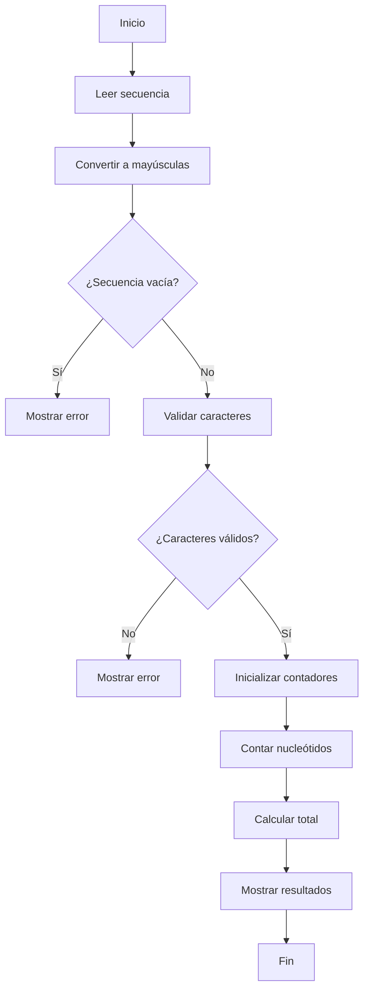

# 🧬 Analizador de Secuencia de DNA (CLI)

## 1. Problema

Se requiere desarrollar un programa en Python que permita analizar una secuencia de DNA ingresada por teclado y reportar el conteo de nucleótidos:

- Adenina (A)
- Timina (T)
- Citosina (C)
- Guanina (G)

El programa está orientado a principiantes, por lo que debe ser:

- Simple
- Lineal
- Fácil de leer
- Sin uso de funciones
- Sin manejo de excepciones (`try/except`)

---

## 2. Requisitos

### Funcionales

- Leer una secuencia desde teclado usando `input()`
- Convertir la secuencia a mayúsculas
- Validar que la secuencia:
  - No esté vacía
  - Solo contenga caracteres válidos (A, T, C, G)
- Contar la frecuencia de cada nucleótido
- Mostrar resultados en pantalla

### No funcionales

- Código claro y didáctico
- Uso de variables simples
- Flujo secuencial
- Fácil de extender en el futuro

---

## 3. Análisis del problema

El problema se puede descomponer en etapas lógicas que representan el flujo de procesamiento de datos:

### 3.1 Entrada
El usuario introduce una secuencia de DNA mediante el teclado.

Ejemplo:
```
ATGCGCATTA
```

### 3.2 Normalización
Se convierte la secuencia a mayúsculas para asegurar consistencia:

- `atgc` → `ATGC`

Esto permite aceptar entradas flexibles sin afectar el análisis.

### 3.3 Validación
Se verifica que:

- La secuencia no esté vacía
- Cada carácter pertenezca al conjunto {A, T, C, G}

Si se detecta un carácter inválido:

- Se detiene el programa
- Se muestra un mensaje de error

### 3.4 Procesamiento
Se realiza el conteo de nucleótidos mediante variables acumuladoras:

- `count_a`
- `count_t`
- `count_c`
- `count_g`

Se recorre la secuencia carácter por carácter y se incrementa el contador correspondiente.

### 3.5 Salida
Se muestra el resultado en formato claro:

```
Nucleotide count:
A: 3
T: 3
C: 2
G: 2
Total: 10
```

---

## 4. Diseño del programa

### 4.1 Enfoque

Se utiliza un enfoque **procedural lineal**, adecuado para principiantes.

Características:

- Un solo archivo
- Sin funciones
- Ejecución paso a paso

### 4.2 Flujo general

1. Leer secuencia
2. Convertir a mayúsculas
3. Validar si está vacía
4. Validar caracteres
5. Contar nucleótidos
6. Mostrar resultados

---

## 5. Algoritmo detallado

A continuación se describe el algoritmo paso a paso:

```
Inicio

1. Mostrar mensaje solicitando secuencia
2. Leer secuencia desde teclado
3. Convertir secuencia a mayúsculas

4. Si la secuencia está vacía:
    Mostrar "Error: secuencia vacía"
    Terminar

5. Inicializar variable de control: es_valida = True

6. Para cada carácter en la secuencia:
    Si el carácter NO es A, T, C o G:
        es_valida = False

7. Si es_valida es False:
    Mostrar "Error: caracteres inválidos"
    Terminar

8. Inicializar contadores:
    count_a = 0
    count_t = 0
    count_c = 0
    count_g = 0

9. Para cada carácter en la secuencia:
    Si es A → count_a++
    Si es T → count_t++
    Si es C → count_c++
    Si es G → count_g++

10. Calcular total = suma de todos los contadores

11. Mostrar resultados

Fin
```

---

## 6. Diagrama de flujo (Mermaid)



---

## 7. Consideraciones finales

- Este diseño prioriza claridad sobre optimización
- Es ideal para aprendizaje inicial en programación
- Puede extenderse fácilmente para:
  - GC content
  - Lectura de archivos FASTA
  - Análisis más complejos

---

## 8. Posibles mejoras futuras

- Modularización con funciones
- Uso de diccionarios para conteo
- Interfaz CLI con `argparse`
- Integración con librerías bioinformáticas como Biopython

